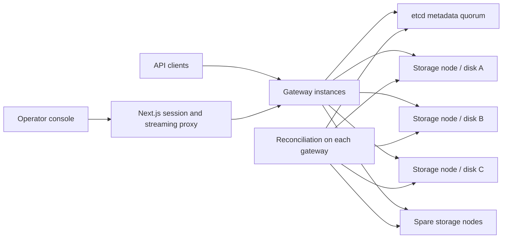

# Architecture and guarantees

## Publication protocol

1. Read the bucket policy, membership revision and current object revision from metadata.
2. Stream the request to a temporary gateway file; compute and validate size and checksums. Memory usage is bounded by stream buffers, independent of the full object size.
3. Assign a unique immutable version and replica ID. Rendezvous hashing selects distinct configured failure domains. When enabled, fallback placement uses reachable spare domains.
4. Transfer to eligible storage nodes. Each node verifies the payload, syncs the data file, atomically publishes and syncs its receipt, then acknowledges.
5. After at least W durable acknowledgements, transactionally compare the object and configuration revisions and publish the object pointer plus idempotency result. A competing write or membership/policy change causes a retryable conflict.
6. Only the metadata-published version is visible to readers. Failed or competing writes may leave inaccessible replica files, but cannot publish a partially stored object.

No object bytes are stored in etcd. Each object and upload part has a separate metadata record. A single multi-key transaction publishes the current object and its request result. The complete multipart transaction also seals the upload session.

## Consistency contract

- In etcd mode, metadata reads are linearizable and commits use consensus transactions. A GET observes a committed object pointer; in-flight concurrent operations may return the version visible when that pointer was read.
- Unconditional concurrent writes can return **409 Conflict**. They do not silently overwrite each other using wall-clock ordering. Clients retry against the latest state.
- `If-Match` protects a known version. `If-None-Match: *` creates only when the object is absent or deleted. Conditional writes are checked again through the metadata revision comparison.
- N is the desired replica count; W is the required number of durable data acknowledgements for publishing a PUT. R is the number of matching replica availability replies required before fetching a GET. Actual download bytes must pass the complete SHA-256 check; an availability reply alone is not proof of intact bytes.
- R is an availability policy, not the source of metadata consistency. The committed metadata pointer determines the version. A request can explicitly choose `one`, `quorum`, or `all`.
- With W=2, an acknowledged PUT has at least two independently placed durable copies at publication. It tolerates loss of one such copy for recoverability, provided metadata quorum survives. Configured read thresholds may still reject a read until redundancy is restored; `consistency=one` can read an intact remaining copy.
- DELETE commits a durable metadata deletion marker. It does not need to store an empty payload on W data nodes. Recovery cannot promote arbitrary bytes from a node back into metadata.
- A timeout can mean an unknown outcome. Retry the same operation with the same `Idempotency-Key`. The transactionally recorded result resolves an already committed operation. Reusing the key for different bytes or a different operation is rejected.
- Loss of metadata quorum freezes both object publication and metadata-authorized reads. This version deliberately does not serve an unverified cached object pointer during a metadata partition.
- Local journal mode provides equivalent single-process compare-and-swap semantics and disk recovery, but has no metadata high availability.

## Recovery and membership

Node health, scrub results and metadata are reconciled on every repair pass. Intact sources are verified, missing or corrupt replicas are rebuilt, and metadata adds newly acknowledged holders with a version/configuration CAS. Work is limited to eight object records per pass and a byte budget; one large object can exceed the budget because transfers are not interrupted midway. Multiple gateways may redundantly repair the same immutable version; checksums and CAS make that safe, but distributed repair leases would reduce duplicate work.

When a node is unavailable, replicas can be rebuilt on spare failure domains even for existing strict buckets. Strict placement limits initial writes; recovery restores durability. Rejoining nodes are trusted only after their actual files and checksums are checked.

Draining excludes a node from new placement. Its holder references are removed only after N distinct non-draining domains are verified. Membership removal waits until no current object references it and no unexpired multipart session is still active. Data on the retired disk is left intact. Node names and domains must reflect actual deployment boundaries; labeling containers as different domains on one machine does not create hardware redundancy.

## Persistence and corruption

Storage receipts include full-object and chunk SHA-256 digests. Storage startup recovers receipt metadata from disk. Background scrubbing detects changed or missing bytes. Reads verify all bytes into a gateway temporary file before sending any object body; the API refuses an object it cannot verify. Current repair copies the full immutable object.

Linux file and directory fsync are used for publication. Windows local runs sync files but cannot make the same POSIX directory-fsync claim. Both storage and local metadata directories have process ownership locks. A partial final journal record is discarded during development-mode recovery; an I/O failure fences subsequent journal operations until restart.

Deletion markers and old versions are retained. This avoids age-only tombstone resurrection and deletion races with readers, but means storage is not reclaimed automatically. This is a documented operational limit rather than an implicit promise of bounded storage growth.
